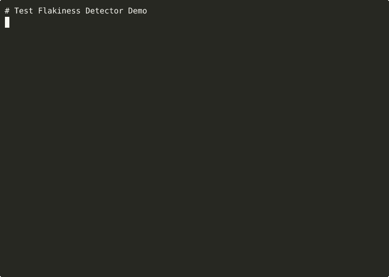

> **Part of [Tuulbelt](https://github.com/tuulbelt/tuulbelt)** — A collection of zero-dependency tools.

# Test Flakiness Detector / `flaky`

[](https://github.com/tuulbelt/test-flakiness-detector/actions/workflows/test.yml)


[](LICENSE)

Detect unreliable tests by running them multiple times and tracking failure rates.

## Problem

Flaky tests—tests that pass sometimes and fail sometimes—are a major pain in software development. They undermine confidence in test suites, cause false alarms in CI/CD pipelines, and waste developer time investigating spurious failures.

This tool runs your test command multiple times and identifies which tests have intermittent failures, helping you target and fix the real problems.

## Features

- **Zero external dependencies** — Uses cli-progress-reporting (Tuulbelt tool composition)
- Works with Node.js 18+
- TypeScript support with strict mode
- Composable via CLI or library API
- Works with any test command (npm test, cargo test, pytest, etc.)
- Configurable number of test runs
- Detailed JSON output with failure statistics
- **Real-time progress tracking** for runs ≥ 5
- Verbose mode for debugging

## Installation

Clone the repository:

```bash
git clone https://github.com/tuulbelt/test-flakiness-detector.git
cd test-flakiness-detector
npm install  # Install dev dependencies only
```

**CLI names** - both short and long forms work:
- Short (recommended): `flaky`
- Long: `test-flakiness-detector`

**Recommended setup** - install globally for easy access:
```bash
npm link  # Enable the 'flaky' command globally
flaky --help
```

**Dependencies:** Uses [cli-progress-reporting](https://github.com/tuulbelt/cli-progress-reporting) for progress tracking (automatically fetched from GitHub during `npm install`). Zero external dependencies per PRINCIPLES.md Exception 2.

## Usage

### As a CLI

```bash
# Run npm test 10 times (default)
flaky --test "npm test"

# Run with 20 iterations
flaky --test "npm test" --runs 20

# Run cargo tests with verbose output
flaky --test "cargo test" --runs 15 --verbose

# Show help
flaky --help
```

### As a Library

**Three-tier API design** following the [Property Validator](https://github.com/tuulbelt/property-validator) gold standard:

#### 1. `detect()` - Full Detection with Detailed Report

Use when you need detailed statistics, individual run results, and comprehensive reports.

```typescript
import { detect } from './src/index.js';

const result = await detect({
  test: 'npm test',
  runs: 20,
  verbose: true,
  threshold: 0.01  // Flag tests with ≥1% failure rate
});

if (result.ok === false) {
  console.error('Detection failed:', result.error.message);
  process.exit(2);
}

const report = result.value;
console.log(`Total runs: ${report.totalRuns}`);
console.log(`Passed: ${report.passedRuns}, Failed: ${report.failedRuns}`);

if (report.flakyTests.length > 0) {
  console.log('\nFlaky tests detected:');
  report.flakyTests.forEach(test => {
    console.log(`  ${test.testName}: ${test.failureRate}% failure rate`);
  });
}
```

#### 2. `isFlaky()` - Fast Boolean Check for CI Gates

Use when you need a quick yes/no answer (optimized for speed with fewer runs).

```typescript
import { isFlaky } from './src/index.js';

const result = await isFlaky({
  test: 'npm test',
  runs: 5  // Faster: default is 5 for quick feedback
});

if (result.ok === false) {
  console.error('Check failed:', result.error.message);
  process.exit(2);
}

if (result.value) {
  console.error('⚠️ Flakiness detected!');
  process.exit(1);
} else {
  console.log('✅ No flakiness detected');
  process.exit(0);
}
```

#### 3. `compileDetector()` - Pre-compiled Detector for Reuse

Use when you need to run the same test multiple times with different run counts (caching optimization).

```typescript
import { compileDetector } from './src/index.js';

// Compile once
const detector = compileDetector({
  test: 'npm test',
  verbose: false,
  threshold: 0.01
});

// Reuse with different run counts
const quick = await detector.run(5);
const standard = await detector.run(10);
const thorough = await detector.run(20);

if (thorough.ok && thorough.value.flakyTests.length > 0) {
  console.log('Flakiness confirmed over 20 runs');
}
```

**Result Type Pattern**: All APIs use `Result<T>` for non-throwing error handling:
```typescript
type Result<T> =
  | { ok: true; value: T }
  | { ok: false; error: Error };
```

Always check `.ok` before accessing `.value`.

**API Selection Guide**:
- 📊 **detect()** — Detailed reports, debugging, analysis (default: 10 runs)
- 🚦 **isFlaky()** — CI gates, quick checks (default: 5 runs, faster)
- 📦 **compileDetector()** — Repeated runs, progressive strategies

See [examples/library-api.ts](examples/library-api.ts) for complete examples.

## CLI Options

- `-t, --test <command>` — Test command to execute (required)
- `-r, --runs <number>` — Number of times to run the test (default: 10, max: 1000)
- `-v, --verbose` — Enable verbose output showing each test run
- `-h, --help` — Show help message

## Output Format

The tool outputs a JSON report with the following structure:

```json
{
  "success": true,
  "totalRuns": 10,
  "passedRuns": 7,
  "failedRuns": 3,
  "flakyTests": [
    {
      "testName": "Test Suite",
      "passed": 7,
      "failed": 3,
      "totalRuns": 10,
      "failureRate": 30.0
    }
  ],
  "runs": [
    {
      "success": true,
      "exitCode": 0,
      "stdout": "...",
      "stderr": ""
    }
    // ... more run results
  ]
}
```

## Exit Codes

- `0` — Success: Detection completed, no flaky tests found
- `1` — Flaky Detected: One or more flaky tests found
- `2` — Invalid Args: Invalid arguments or validation error

**Example:**
```bash
flaky --test "npm test" --runs 10
echo $?  # 0 = no flaky, 1 = flaky found, 2 = invalid args
```

This separation enables better CI/CD integration: distinguish between flakiness (exit 1, fail the build) and configuration errors (exit 2, notify developer).

## CI Integration

Integrate flakiness detection into your CI/CD pipelines:

### GitHub Actions

**Quick CI Gate** (fails PR if flaky tests detected):
```yaml
name: Test
on: [push, pull_request]
jobs:
  test:
    runs-on: ubuntu-latest
    steps:
      - uses: actions/checkout@v4
      - uses: actions/setup-node@v4
      - run: npm ci
      - run: npm test
      - name: Check for flaky tests
        run: npx tsx examples/ci-integration.ts github-actions
```

**Nightly Flakiness Report** (comprehensive detection):
```yaml
name: Nightly Flakiness Check
on:
  schedule:
    - cron: '0 2 * * *'  # 2 AM daily
jobs:
  flakiness-check:
    runs-on: ubuntu-latest
    steps:
      - uses: actions/checkout@v4
      - uses: actions/setup-node@v4
      - run: npm ci
      - name: Deep flakiness detection
        run: npx tsx examples/ci-integration.ts github-actions-full
      - uses: actions/upload-artifact@v4
        if: always()
        with:
          name: flakiness-report
          path: flakiness-report.json
```

### GitLab CI

```yaml
test:
  stage: test
  script:
    - npm ci
    - npm test
    - npx tsx examples/ci-integration.ts gitlab-ci
  artifacts:
    when: always
    paths:
      - flakiness-report.json
```

### Jenkins

```groovy
pipeline {
  agent any
  stages {
    stage('Test') {
      steps {
        sh 'npm ci'
        sh 'npm test'
      }
    }
    stage('Flakiness Check') {
      steps {
        sh 'npx tsx examples/ci-integration.ts jenkins'
        archiveArtifacts artifacts: 'flakiness-report.json'
      }
    }
  }
}
```

### CircleCI

```yaml
version: 2.1
jobs:
  test:
    docker:
      - image: cimg/node:20.11
    steps:
      - checkout
      - run: npm ci
      - run: npm test
      - run:
          name: Check for flaky tests
          command: npx tsx examples/ci-integration.ts circleci
      - store_artifacts:
          path: flakiness-report.json
```

**See [examples/ci-integration.ts](examples/ci-integration.ts) for complete CI/CD integration examples.**

## Examples

### Detect Flaky npm Tests

```bash
flaky --test "npm test" --runs 20
```

### Detect Flaky Rust Tests

```bash
flaky --test "cargo test" --runs 15
```

### Detect Flaky Python Tests

```bash
flaky --test "pytest tests/" --runs 10
```

### With Verbose Output

```bash
flaky --test "npm test" --runs 5 --verbose
```

This will show:
```
[INFO] Running test command 5 times: npm test
[INFO] Run 1/5
[RUN] Executing: npm test
[INFO] Run 2/5
...
[INFO] Completed 5 runs: 4 passed, 1 failed
[WARN] Detected flaky tests!
```

## Example Outputs

See what to expect from the tool with these real examples:

<details>
<summary>📊 Example 1: All Tests Passing (click to expand)</summary>

```bash
flaky --test "echo 'test passed'" --runs 5
```

```json
{
  "success": true,
  "totalRuns": 5,
  "passedRuns": 5,
  "failedRuns": 0,
  "flakyTests": [],
  "runs": [
    {
      "success": true,
      "exitCode": 0,
      "stdout": "test passed\n",
      "stderr": ""
    }
    // ... 4 more successful runs
  ]
}
```

**Result:** ✅ No flaky tests detected. All 5 runs passed consistently.

</details>

<details>
<summary>📊 Example 2: All Tests Failing (click to expand)</summary>

```bash
flaky --test "exit 1" --runs 3
```

```json
{
  "success": true,
  "totalRuns": 3,
  "passedRuns": 0,
  "failedRuns": 3,
  "flakyTests": [],
  "runs": [
    {
      "success": false,
      "exitCode": 1,
      "stdout": "",
      "stderr": ""
    }
    // ... 2 more failed runs
  ]
}
```

**Result:** ✅ No flakiness detected. Tests fail consistently (not intermittent).

</details>

<details>
<summary>🔴 Example 3: Flaky Tests Detected (click to expand)</summary>

```bash
flaky --test 'node -e "process.exit(Math.random() > 0.5 ? 0 : 1)"' --runs 20
```

```json
{
  "success": true,
  "totalRuns": 20,
  "passedRuns": 11,
  "failedRuns": 9,
  "flakyTests": [
    {
      "testName": "Test Suite",
      "passed": 11,
      "failed": 9,
      "totalRuns": 20,
      "failureRate": 45.0
    }
  ],
  "runs": [
    // Mix of passing and failing runs
  ]
}
```

**Result:** ⚠️ **Flaky test detected!** 45% failure rate (9 failures out of 20 runs).
**Action:** This test needs investigation and fixing.

</details>

<details>
<summary>💬 Example 4: Verbose Mode Output (click to expand)</summary>

```bash
flaky --test "echo 'test'" --runs 3 --verbose
```

```
[INFO] Running test command 3 times: echo 'test'
[INFO] Run 1/3
[RUN] Executing: echo 'test'
[INFO] Run 2/3
[RUN] Executing: echo 'test'
[INFO] Run 3/3
[RUN] Executing: echo 'test'
[INFO] Completed 3 runs: 3 passed, 0 failed
{
  "success": true,
  "totalRuns": 3,
  "passedRuns": 3,
  "failedRuns": 0,
  "flakyTests": [],
  ...
}
```

**Result:** Shows detailed execution logs plus JSON output.

</details>

> **Note:** Example outputs are auto-generated and committed to [`examples/outputs/`](examples/outputs/) directory.
> See [`.github/workflows/create-demo.yml`](.github/workflows/create-demo.yml) for automation details.

## Try It Yourself

### Quick Start

```bash
git clone https://github.com/tuulbelt/test-flakiness-detector.git
cd test-flakiness-detector
npm install
flaky --test "npm test" --runs 10
```

### One-Click Playground

[](https://stackblitz.com/github/tuulbelt/test-flakiness-detector)

Try the tool instantly in your browser without installing anything!

## How It Works

1. The tool executes the specified test command N times
2. It captures the exit code, stdout, and stderr for each run
3. It tracks how many times the tests passed vs. failed
4. If some runs pass and some fail, the test suite is flagged as flaky
5. A detailed JSON report is generated with failure statistics

## Architecture

**Execution Strategy:**
1. Validate input (test command is non-empty string, runs are between 1-1000)
2. Execute test command synchronously N times using `child_process.execSync`
3. Capture exit code, stdout, and stderr for each execution
4. Record pass (exit code 0) or fail (non-zero exit code) for each run
5. Calculate flakiness: if passedRuns > 0 AND failedRuns > 0, tests are flaky
6. Generate comprehensive JSON report with all run results and statistics

**Dependencies:**
- **Node.js standard library** — Uses `child_process` module for command execution
- **cli-progress-reporting** — Tuulbelt tool for real-time progress tracking (PRINCIPLES.md Exception 2)
- Zero external dependencies

**Key Design Choices:**
- **Synchronous execution**: Tests run sequentially to avoid false flakiness from resource contention
- **Suite-level detection**: Tracks entire test command success/failure, not individual test names
- **No timeout**: Waits for command completion to avoid flagging slow tests as flaky
- **Result pattern**: Returns structured result object, never throws exceptions

## Security

- **Trusted commands only**: The `--test` command is executed via shell—only run trusted commands
- **Same trust model**: This tool has the same security model as `npm run-script`, `make`, or any build tool
- **Resource limits**: 10MB buffer limit per command output, max 1000 runs
- **No privilege escalation**: User runs their own commands with their own permissions

## Testing

```bash
npm test              # Run all tests
npm test -- --watch   # Watch mode
```

The test suite includes:
- Basic functionality tests
- Input validation tests
- Flaky test detection tests
- Edge case handling tests
- Error scenario tests
- Property-based fuzzy tests

### Dogfooding: Tool Composition

This tool demonstrates the power of composability by both USING and VALIDATING other Tuulbelt tools:

#### 1. Uses CLI Progress Reporting (Library Integration)

```bash
flaky --test "npm test" --runs 10 --verbose
# [INFO] Progress tracking enabled (dogfooding cli-progress-reporting)
# [INFO] Run 1/10
# [INFO] Run 2/10
# ...
```

The flakiness detector **requires** [cli-progress-reporting](https://github.com/tuulbelt/cli-progress-reporting) as a dependency (automatically fetched from GitHub). This demonstrates Tuulbelt-to-Tuulbelt composition (PRINCIPLES.md Exception 2) and provides:
- Live run counts and pass/fail status during detection (≥5 runs)
- Better UX for long detection runs (50-100 iterations)
- Real-world validation of the progress reporting tool
- Proof that Tuulbelt tools compose naturally while preserving zero external dependencies

#### 2. High-Value Composition Scripts

**Output Diffing Utility** - Find ROOT CAUSE of flaky tests:
```bash
./scripts/dogfood-diff.sh "npm test"
# Compares outputs between runs to see WHAT changes
# Helps identify: timestamps, random data, race conditions
```

**Cross-Platform Path Normalizer** - Validate path handling reliability:
```bash
./scripts/dogfood-paths.sh 10
# ✅ NO FLAKINESS DETECTED
# 145 tests × 10 runs = 1,450 executions
```

**CLI Progress Reporting** - Bidirectional validation:
```bash
./scripts/dogfood-progress.sh 20
# Validates the tool we USE (bidirectional relationship)
# 125 tests × 20 runs = 2,500 executions
```

**Complete Phase 1 Validation Pipeline** - Validate all tools:
```bash
./scripts/dogfood-pipeline.sh 10
# Validates all 5 Phase 1 tools
# 602 tests × 10 runs = 6,020 total test executions
```

See `DOGFOODING_STRATEGY.md` for implementation details.

## Error Handling

The tool handles various error scenarios gracefully:

- Invalid or non-existent commands
- Command syntax errors
- Commands that hang or timeout
- Empty or malformed input

Errors are returned in the `error` field of the result object, not thrown.

## Performance

- **Time complexity**: O(N × T) where N = number of runs, T = time per test execution
- **Space complexity**: O(N × S) where N = number of runs, S = size of stdout/stderr per run
- **Resource limits**:
  - Maximum runs: 1000 (configurable, prevents resource exhaustion)
  - Maximum buffer per run: 10MB (stdout + stderr combined)
  - No artificial timeout (waits for natural command completion)
- **Execution**: Sequential, not parallel (avoids false flakiness from resource contention)

## Limitations

- Currently detects flakiness at the test suite level (entire command pass/fail)
- Does not parse individual test names from test runner output
- Maximum of 1000 runs per detection (to prevent resource exhaustion)
- stdout/stderr buffer limited to 10MB per run

## Future Enhancements

Potential improvements for future versions:

- Parse individual test names from popular test runners (Jest, Mocha, pytest, cargo test)
- Track flakiness per individual test, not just test suite
- Calculate statistical confidence intervals for failure rates
- Support for parallel test execution to speed up detection
- Integration with CI/CD systems (GitHub Actions, GitLab CI)

## Specification

See [SPEC.md](SPEC.md) for detailed technical specification.


## Demo



**[▶ View interactive recording on asciinema.org](https://asciinema.org/a/1Swn7Cta5dSsMVLPLPKNYmKcm)**

> Try it online: [](https://stackblitz.com/github/tuulbelt/test-flakiness-detector)

## License

MIT — see [LICENSE](LICENSE)

## Contributing

See [CONTRIBUTING.md](https://github.com/tuulbelt/tuulbelt/blob/main/CONTRIBUTING.md) for contribution guidelines.

## Related Tools

Part of the [Tuulbelt](https://github.com/tuulbelt/tuulbelt) collection:
- [CLI Progress Reporting](https://github.com/tuulbelt/cli-progress-reporting) — Concurrent-safe progress updates
- More tools coming soon...
